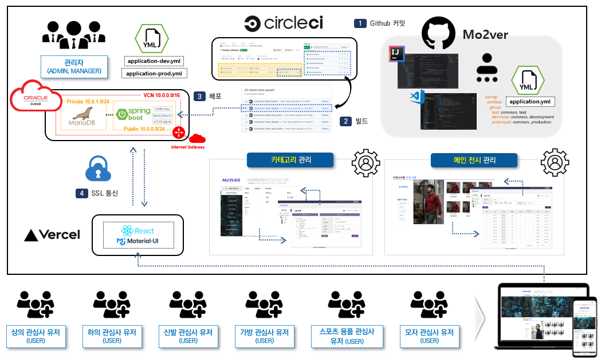
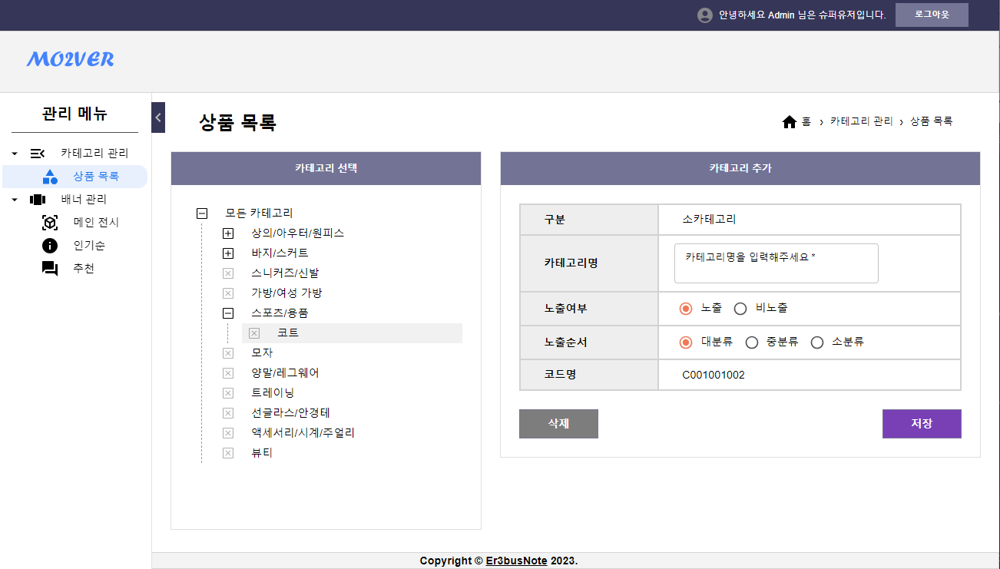

# Mo2ver - wearhouse
사용자 맞춤형 의류 중고거래 사이트

## Infra & Concept

## Init Setting
- [Spring Data JPA](https://start.spring.io/#!type=gradle-project&language=java&platformVersion=2.7.3&packaging=jar&jvmVersion=1.8&groupId=com.mo2ver&artifactId=master&name=master&description=Mo2ver%20project%20for%20Spring%20Boot&packageName=com.mo2ver.master&dependencies=data-jpa,validation,security,mail,devtools,mariadb,lombok)
- [Spring Batch](https://start.spring.io/#!type=gradle-project&language=java&platformVersion=2.7.3&packaging=jar&jvmVersion=1.8&groupId=com.mo2ver&artifactId=batch&name=batch&description=Mo2ver%20project%20for%20Spring%20Batch&packageName=com.mo2ver.batch&dependencies=batch,mariadb,lombok)

## Compatible
- JAVA: OpenJDK 1.8.0_282
- DB: 10.4.11-MariaDB

### Demo Website Link
Under construction of demo website.
- URL : [Demo](https://mo2ver.vercel.app/)

## User Page

	
	
	

## Admin Page

## Contact us
- qudwn0768@naver.com