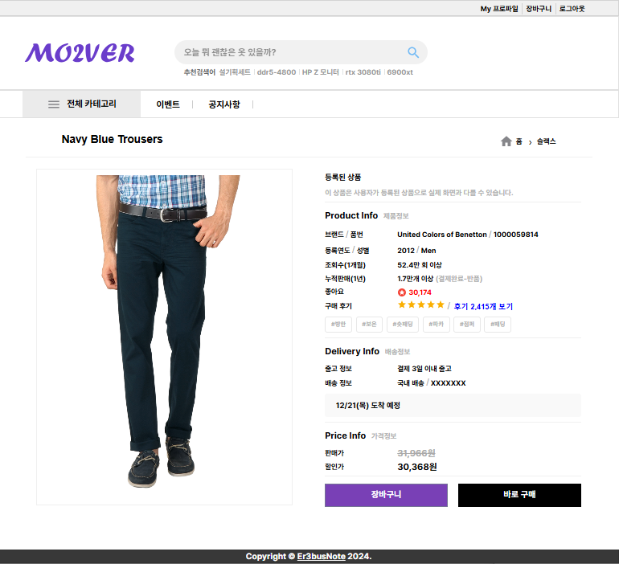
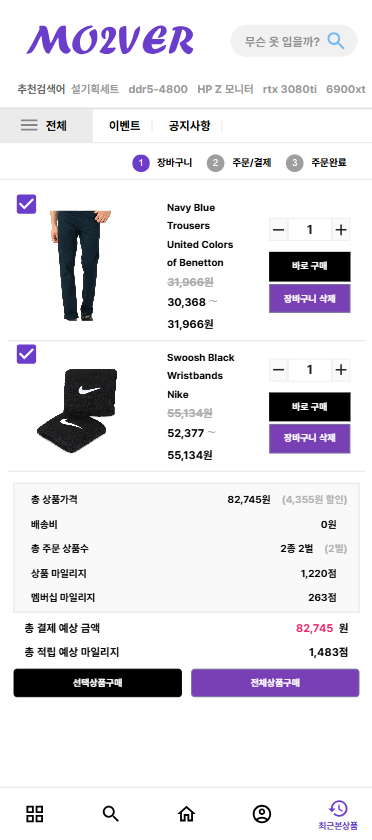
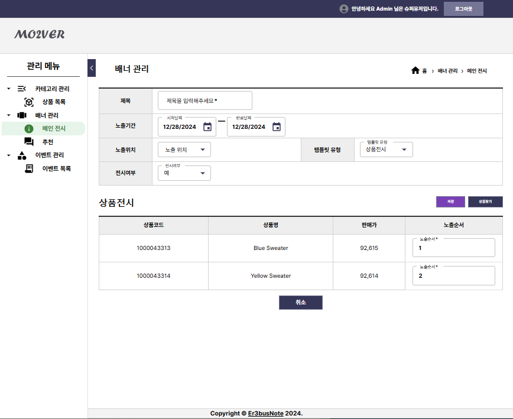
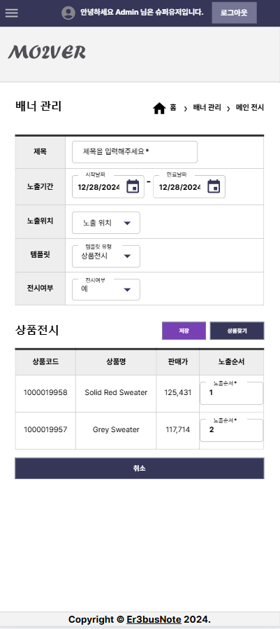
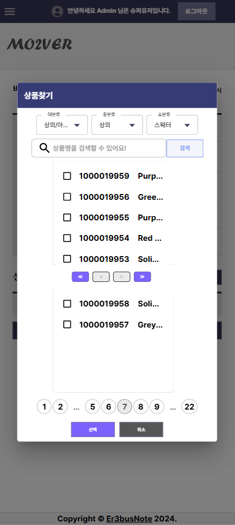

# Mo2ver

사용자 맞춤형 의류 중고거래 사이트

## Infra & Concept

## Init Setting
- [Spring Data JPA](https://start.spring.io/#!type=gradle-project&language=java&platformVersion=2.7.3&packaging=jar&jvmVersion=1.8&groupId=com.mo2ver&artifactId=mo2ver&name=mo2ver&description=Mo2ver%20project%20for%20Spring%20Boot&packageName=com.mo2ver.web&dependencies=data-jpa,validation,security,mail,devtools,mariadb,lombok)
- [Spring Batch](https://start.spring.io/#!type=gradle-project&language=java&platformVersion=2.7.3&packaging=jar&jvmVersion=1.8&groupId=com.mo2ver&artifactId=batch&name=batch&description=Mo2ver%20project%20for%20Spring%20Batch&packageName=com.mo2ver.batch&dependencies=batch,mariadb,lombok) for **`Data Migration`**

## Compatible
- JAVA: OpenJDK 1.8.0_282
- DB: 10.4.11-MariaDB
- Node: 16.14.2 → 20.11.0 (**`dependency issue..!`**)
- Server: Oracle Cloud VM.Standard.E2.1.Micro → **`1 OCPU`**, **`1GB Memory`** (**`free tier`**)
- Network: Oracle Cloud VCN → **`Internet Gateway`** (**`free tier`** is not support **`NAT Gateway`**)

**Note**: For **dump data**, temporarily used [Fashion Product Images Dataset](https://www.kaggle.com/datasets/paramaggarwal/fashion-product-images-dataset) (with , **`MIT License`**). Once product verification is complete, the data will be deleted again in batches.

## Demo Website Link
Under construction of demo website.
- URL : [Demo](https://mo2ver.vercel.app/)

## User Page
| 대시보드 | 카테고리 | 대시보드 M | 검색 M |
| :-----: | :-----: | :-----: | :-----: |
|  |  |  |  |

- **대시보드** (PC) : 반응형 PC 대시보드 화면
- **카테고리** (PC) : 반응형 PC 카테고리 화면
- **대시보드 M** (MOBILE) : 반응형 Mobile 대시보드 화면
- **검색 M** (MOBILE) : 반응형 Mobile 검색 화면 (<ins>**개발 中**</ins>)

| 상품 상세 | 상품 등록 | 장바구니 | 장바구니 M |
| :------: | :------: | :-----: | :-----: |
|  |  |  |  |

- **상품 상세** (PC) : 반응형 PC 상품 상세 화면
- **상품 등록** (PC) : 반응형 PC 상품 등록 화면
- **장바구니** (PC) : 반응형 PC 장바구니 화면
- **장바구니 M** (MOBILE) : 반응형 Mobile 장바구니 화면

| 주문/배송내역 | 상품등록내역 | 주문/배송내역 M |
| :--------: | :--------: | :--------: |
|  |  |  |

- **주문/배송내역** (PC) : 반응형 PC 주문/배송내역 화면 (<ins>**개발 中**</ins>)
- **상품등록내역** (PC) : 반응형 PC 상품등록내역 화면 (<ins>**개발 中**</ins>)
- **주문/배송내역 M** (MOBILE) : 반응형 Mobile 주문/배송내역 화면 (<ins>**개발 中**</ins>)

## Admin Page
| 카테고리 관리 | 배너 메인 이미지 등록 | 배너 메인 이미지 목록 |
| :---------: | :-------: | :-------: |
|  |  |  |

- **카테고리 관리** (PC) : 반응형 PC 카테고리 관리 화면
- **배너 메인 이미지 등록** (PC) : 반응형 PC 배너 관리 등록 화면
- **배너 메인 이미지 목록** (PC) : 반응형 PC 배너 관리 목록 화면

| 상품 전시 등록  | 상품 전시 선택 | 상품 전시 등록 M | 상품 전시 선택 M |
| :------: | :------: | :------: | :------: |
|  |  |  |  |

- **상품 전시 등록** (PC) : 반응형 PC 상품 전시 등록 화면
- **상품 전시 선택** (PC) : 반응형 PC 상품 전시 등록 선택 화면
- **상품 전시 등록 M** (MOBILE) : 반응형 Mobile 전시 등록 화면
- **상품 전시 선택 M** (MOBILE) : 반응형 Mobile 전시 등록 선택 화면

## Contact us
- qudwn0768@naver.com