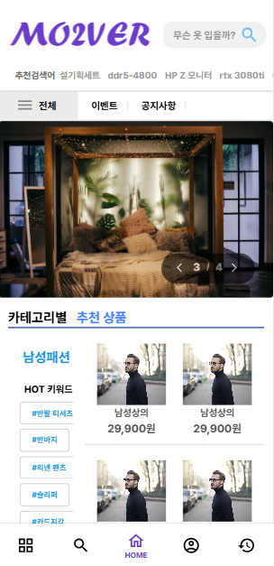

# Mo2ver - wearhouse
사용자 맞춤형 의류 중고거래 사이트

## Infra & Concept

## Init Setting
- [Spring Data JPA](https://start.spring.io/#!type=gradle-project&language=java&platformVersion=2.7.3&packaging=jar&jvmVersion=1.8&groupId=com.mo2ver&artifactId=master&name=master&description=Mo2ver%20project%20for%20Spring%20Boot&packageName=com.mo2ver.master&dependencies=data-jpa,validation,security,mail,devtools,mariadb,lombok)
- [Spring Batch](https://start.spring.io/#!type=gradle-project&language=java&platformVersion=2.7.3&packaging=jar&jvmVersion=1.8&groupId=com.mo2ver&artifactId=batch&name=batch&description=Mo2ver%20project%20for%20Spring%20Batch&packageName=com.mo2ver.batch&dependencies=batch,mariadb,lombok)

## Compatible
- JAVA: OpenJDK 1.8.0_282
- DB: 10.4.11-MariaDB
- Node: 16.14.2 → 20.11.0 (dependency issue..!)

### Demo Website Link
Under construction of demo website.
- URL : [Demo](https://mo2ver.vercel.app/)

## User Page
<table>
	<tr>
		<th colspan="4" style="text-align: center;">HOME</th>
	</tr>
	<tr>
		<td style="text-align: center;">
			
			 <lebel>Dashboard (PC)</label>
		</td>
		<td style="text-align: center;">
			
			 <lebel>Category (PC)</label>
		</td>
		<td style="text-align: center;">
			
			 <lebel>Dashboard (Mobile)</label>
		</td>
		<td style="text-align: center;">
			
			 <lebel>Search (Mobile)</label>
		</td>
	</tr>
	<tr>
		<th colspan="2" style="text-align: center;">GOODS</th>
		<th colspan="2" style="text-align: center;">CART</th>
	</tr>
	<tr>
		<td style="text-align: center;">
			
			 <lebel>Detail (PC)</label>
		</td>
		<td style="text-align: center;">
			
			 <lebel>Register (PC)</label>
		</td>
		<td style="text-align: center;">
			
			 <lebel>CART (PC)</label>
		</td>
		<td style="text-align: center;">
			
			 <lebel>CART (Mobile)</label>
		</td>
	</tr>
	<tr>
		<th colspan="4" style="text-align: center;">PROFILE</th>
	</tr>
	<tr>
		<td colspan="3" style="text-align: center;">
			
			
			 <lebel>My Profile (PC)</label>
		</td>
		<td style="text-align: center;">
			
			 <lebel>My Profile (Mobile)</label>
		</td>
	</tr>
</table>

## Admin Page
<table>
	<tr>
		<th style="text-align: center;">CATEGORY (Manage)</th>
		<th colspan="3" style="text-align: center;">BANNER (Manage)</th>
	</tr>
	<tr>
		<td style="text-align: center;">
			
		</td>
		<td colspan="3" style="text-align: center;">
			
			
		</td>
	</tr>
	<tr>
		<th colspan="4" style="text-align: center;">GOODS (Manage)</th>
	</tr>
	<tr>
		<td style="text-align: center;">
			
		</td>
		<td style="text-align: center;">
			
		</td>
		<td style="text-align: center;">
			
		</td>
		<td style="text-align: center;">
			
		</td>
	</tr>
</table>

## Contact us
- qudwn0768@naver.com